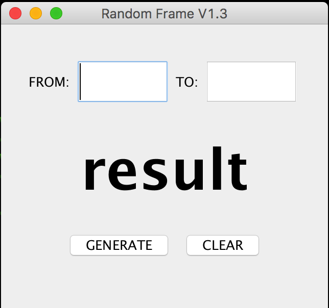

# RandomFrame

This is a little application written in Java that can generate a ranged random number within a GUI. This idea came out when my teacher was using our mathematic calculator in the front of our classromm to get a random number to let the person matched with the number answer the question. I thought the computer could help a lot, so the codes here was written.

If you look through all the codes here considerately, you may notice that I did something interesting to the program that it will never generate 3 specified numbers given by the user via an invisible way. This function can help me prevent my teacher from letting me answer the question, because there are still some friends of mine who are not good at English, so I can still get another two students out of the trouble made by our psychopath teachers. 

  

